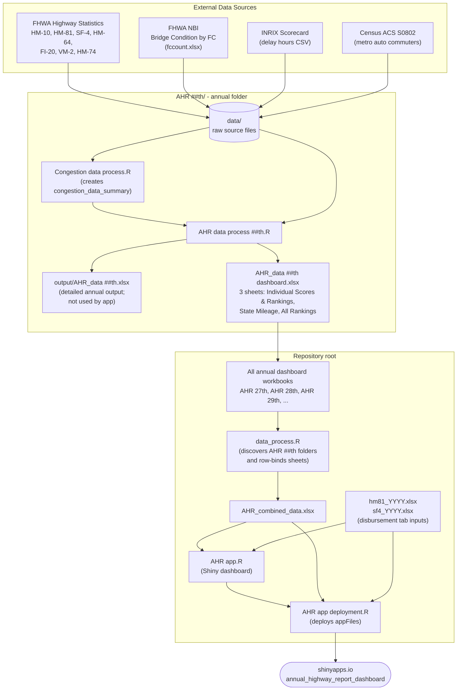

# Annual Highway Report Dashboard

This repository supports Reason Foundation's Annual Highway Report update and the Shiny dashboard that publishes the state rankings and supporting metric tables.

The core workflow is:

1. Update the annual raw data in a new `AHR ##th/data/` folder.
2. Run that year's annual processing script from inside the annual folder.
3. Regenerate that year's dashboard workbook.
4. Run root-level `data_process.R` to combine the new dashboard workbook with prior years.
5. Test `AHR app.R`.
6. Deploy with `AHR app deployment.R`.

The diagram below shows how raw data flows through the annual folder into the combined workbook and out to the deployed Shiny app:



At the time this README was written, Reason's current public report was the [29th Annual Highway Report](https://reason.org/highway-report/), published March 19, 2026. The report explains that the ranking uses 13 categories covering spending, pavement condition, congestion, bridges, and fatalities, with data primarily from FHWA Highway Statistics plus bridge/NBI and INRIX congestion data. The local code follows that structure, but each future update should still begin by checking the latest published methodology and source notes.

## Repository Layout

```text
.
|-- AHR app.R                         # Shiny dashboard
|-- AHR app deployment.R              # shinyapps.io deployment script
|-- data_process.R                    # Combines annual dashboard workbooks
|-- AHR_combined_data.xlsx            # Combined app input generated by data_process.R
|-- hm81_2023.xlsx                    # Root app input for disbursement illustration
|-- sf4_2023.xlsx                     # Root app input for disbursement illustration
|-- AHR 27th/                         # Annual processing folder/archive
|-- AHR 28th/
|-- AHR 29th/
|   |-- AHR data process 29th.R       # Main annual processing script
|   |-- Congestion data process.R     # Congestion sub-pipeline
|   |-- data/                         # Raw annual source files
|   |-- output/AHR_data 29th.xlsx     # Detailed annual output
|   `-- AHR_data 29th dashboard.xlsx  # Annual dashboard workbook
`-- state-vignettes/                  # Separate state summary document workflow
```

The Shiny deployment path depends only on the root files, but the root files are generated from the annual folders.

## R Dependencies

Install the packages used by the current scripts before running the project:

```r
install.packages(c(
  "broom",
  "dplyr",
  "janitor",
  "leaflet",
  "modelr",
  "plotly",
  "reactable",
  "readxl",
  "rio",
  "rsconnect",
  "scales",
  "sf",
  "shiny",
  "tigris",
  "tidyverse"
))
```

The code uses relative paths. Run annual scripts from their own annual folder, and run app/combine/deploy scripts from the repository root.

## Annual Update Workflow

### 1. Confirm the Target Vintage

Before downloading anything, confirm the data year the report team intends to use. The report number and publication year are not always the same as the underlying data year because FHWA, ACS, INRIX, and bridge data are released on different schedules.

For example, the 29th Annual Highway Report was published in 2026 but uses 2023 as the main performance year in the local processing script. Do not assume the next report simply uses the next calendar year; confirm it against the latest report plan and available source data.

Record these decisions before editing the code:

- report number and folder name, such as `AHR 29th`
- primary FHWA Highway Statistics year
- ACS S0802 year and whether the 1-year subject table is available
- INRIX scorecard year and whether the file contains the target year's hours directly or requires deriving them from a later scorecard's year-over-year change
- bridge data vintage and source workbook layout

In the examples below, `{ordinal}` means the report number plus suffix, such as `29th`, `30th`, or `31st`. Replace placeholders before running commands.

The working rule is that all datasets for a report should be aligned to one target data year. For the 29th report, that target year is 2023: the FHWA Highway Statistics inputs are 2023, ACS S0802 is 2023, the bridge sheet is 2023, the dashboard output is labeled `year = 2023`, and the INRIX input is transformed to 2023 even though the available source file is a 2024 scorecard export. Exceptions should be rare and documented. The South Carolina HM-64 patch in the 29th report is one such exception because the 2023 HM-64 table did not provide usable reported rural/urban Interstate totals for South Carolina.

### 2. Create the Annual Folder

Copy the latest annual folder and rename it for the new report. Use the same ordinal naming convention as the existing folders.

```text
AHR {ordinal}/
```

Examples:

```text
AHR 29th/
AHR 30th/
AHR 31st/
```

Then rename the main script and output references to match the annual folder:

```text
AHR {ordinal}/AHR data process {ordinal}.R
AHR {ordinal}/AHR_data {ordinal} dashboard.xlsx
AHR {ordinal}/output/AHR_data {ordinal}.xlsx
```

Keep the folder naming pattern exactly as `AHR 29th`, `AHR 30th`, `AHR 31st`, etc. Root-level `data_process.R` discovers annual folders with this pattern:

```r
^./AHR \d+(st|nd|rd|th)$
```

### 3. Collect Annual Raw Data

Put all annual source files in the annual folder's `data/` directory. The current scripts expect these local file names unless you update the code. The downloaded source file names and extensions may differ; either rename them to match the script or update the relevant `read_excel()` / `read_csv()` calls.

| Expected file | Source | Used for |
| --- | --- | --- |
| `hm10.xlsx` | FHWA Highway Statistics, Table HM-10 | Public road length by ownership; state highway agency centerline miles |
| `hm81.xlsx` | FHWA Highway Statistics, Table HM-81 | State highway agency lane-miles and percent urban lane-miles |
| `sf4.xlsx` | FHWA Highway Statistics, Table SF-4 | State-administered highway disbursements |
| `hm64.xlsx` | FHWA Highway Statistics, Table HM-64 | Rural/urban Interstate and arterial pavement condition |
| `fi20.xls` | FHWA Highway Statistics, Table FI-20 | Fatalities by state and functional system |
| `vm2.xlsx` | FHWA Highway Statistics, Table VM-2 | Annual vehicle-miles by state and functional system |
| `hm74.xlsx` | FHWA Highway Statistics, Table HM-74 | Urbanized-area DVMT shares for apportioning congestion across states |
| `fccount.xlsx` | FHWA National Bridge Inventory, Bridge Condition by Functional Classification, Count multi-year workbook | Total bridges and poor bridges |
| `inrix_delay_hour_{year}.csv` | INRIX Global Traffic Scorecard | Urban-area congestion hours |
| `ACSST1Y{year}.S0802-Data.csv` | Census ACS 1-Year Subject Table S0802 for metropolitan statistical areas | Metro-area auto commuter counts |
| `ACSST1Y{year}.S0802-Column-Metadata.csv` | Census ACS S0802 data.census.gov export | Metadata, retained with the ACS export |
| `ACSST1Y{year}.S0802-Table-Notes.txt` | Census ACS S0802 data.census.gov export | Notes, retained with the ACS export |

Useful source pages:

- Reason report archive and current report: <https://reason.org/highway-report/>
- 29th Annual Highway Report PDF: <https://reason.org/wp-content/uploads/29th-annual-highway-report.pdf>
- FHWA Highway Statistics 2024 index: <https://www.fhwa.dot.gov/policyinformation/statistics/2024/>
- FHWA Highway Statistics 2023 index: <https://www.fhwa.dot.gov/policyinformation/statistics/2023/>
- FHWA HM-64 2023 table: <https://www.fhwa.dot.gov/policyinformation/statistics/2023/hm64.cfm>
- FHWA HM-64 2022 table: <https://www.fhwa.dot.gov/policyinformation/statistics/2022/hm64.cfm>
- FHWA NBI Bridge Condition by Functional Classification: <https://www.fhwa.dot.gov/bridge/fc.cfm>
- ACS subject tables: <https://www.census.gov/acs/www/data/data-tables-and-tools/subject-tables/>
- ACS S0802 2023 table: <https://data.census.gov/table/ACSST1Y2023.S0802>
- INRIX scorecard: <https://inrix.com/scorecard/>

The FHWA URL pattern is usually:

```text
https://www.fhwa.dot.gov/policyinformation/statistics/{year}/{table}.cfm
```

For example:

```text
https://www.fhwa.dot.gov/policyinformation/statistics/2024/hm10.cfm
https://www.fhwa.dot.gov/policyinformation/statistics/2024/hm81.cfm
https://www.fhwa.dot.gov/policyinformation/statistics/2024/sf4.cfm
https://www.fhwa.dot.gov/policyinformation/statistics/2024/hm64.cfm
https://www.fhwa.dot.gov/policyinformation/statistics/2024/fi20.cfm
https://www.fhwa.dot.gov/policyinformation/statistics/2024/vm2.cfm
https://www.fhwa.dot.gov/policyinformation/statistics/2024/hm74.cfm
```

Download the Excel version of each FHWA table from the Highway Statistics index for the target data year, then save it with the local file name shown above. The annual scripts read fixed sheet names and column positions, so do not manually reshape the workbooks unless the FHWA format has changed and the code is updated accordingly.

After downloading, compare each workbook's sheet names and header layout to the prior year's local file. The current scripts assume:

- HM-10, HM-81, SF-4, HM-64, VM-2, and bridge workbooks can be read with specific sheets such as `A`, `B`, `C`, `D`, or a year-named bridge sheet.
- FI-20 and VM-2 use skipped header rows in the annual script.
- HM-74 has the expected urbanized-area sheets; the 29th-report congestion script processes sheets `2:9`.

If a source workbook layout changes, update the code first and then rerun the checks. Do not force the downloaded file into the old layout by hand unless the change is documented.

### 4. ACS S0802 Download

The congestion pipeline uses ACS subject table S0802, "Means of Transportation to Work by Selected Characteristics", to estimate auto commuters in metro areas.

Use the data.census.gov table export, not a hand-built spreadsheet. The direct table URL follows this pattern:

```text
https://data.census.gov/table/ACSST1Y{year}.S0802
```

For the 29th report, the file came from:

```text
https://data.census.gov/table/ACSST1Y2023.S0802
```

In data.census.gov:

1. Set the year to the report's target data year.
2. Use `ACS 1-Year Estimates Subject Tables`.
3. Select table `S0802`, `Means of Transportation to Work by Selected Characteristics`.
4. Select **Metropolitan Statistical Areas** for the geography. The intended file is metro areas, not states, counties, places, census tracts, or micropolitan-only areas.
5. Select all U.S. metropolitan statistical areas available for the chosen ACS 1-year product.
6. Download/export the table as CSV.
7. Place the exported files in the annual `data/` folder with the default Census names, such as:

```text
ACSST1Y2024.S0802-Data.csv
ACSST1Y2024.S0802-Column-Metadata.csv
ACSST1Y2024.S0802-Table-Notes.txt
```

Then update `Congestion data process.R` if the file names or year changed.

Do **not** use these unless you also update the code:

- ACS 5-Year estimates, unless the report methodology explicitly changes
- ACS Supplemental Estimates
- S0801 or S0804; this pipeline expects S0802 residence-based commuting data, not workplace geography
- state, county, place, tract, or block-group geographies
- a manually edited CSV with renamed or deleted Census columns

The current code uses:

```r
read_csv("data/ACSST1Y2023.S0802-Data.csv")
```

and reads these Census export columns:

```r
NAME             # metro-area name
S0802_C02_001E   # workers 16+ who drove alone
S0802_C03_001E   # workers 16+ who carpooled
```

The code estimates combined auto commuters as:

```r
auto_commuters_alone + auto_commuters_carpooled / 2.2
```

If Census changes S0802 column names, or if the report methodology changes the carpool occupancy assumption, update `Congestion data process.R` and document the change in the report notes.

Quick validation after downloading:

```r
library(readr)
d <- read_csv("data/ACSST1Y{year}.S0802-Data.csv", show_col_types = FALSE)
required <- c("GEO_ID", "NAME", "S0802_C02_001E", "S0802_C03_001E")
setdiff(required, names(d))
sum(grepl("Metro Area", d$NAME))
sum(grepl("Micro Area", d$NAME))
head(d$GEO_ID)
```

Expected signs that the file is correct:

- The required columns are present.
- The geography rows are metropolitan statistical areas, with names ending in `Metro Area`.
- The `GEO_ID` values for actual data rows look like `310M700US...`.
- The CSV may include Census' second label row after the header row; do not manually delete it unless you also confirm the script still reads the file correctly.

The local 29th-report ACS file has 393 metro-area data rows plus the Census label row. If future ACS geography definitions change, the row count may change, so use the geography and required-column checks rather than a fixed row-count check.

### 5. INRIX Congestion Data

The current 29th-report congestion script reads:

```r
read_csv("data/inrix_delay_hour_2024.csv")
```

and then calculates 2023 delay using the `change_from_2023` column:

```r
delay_2023 = round(delay_2024 / (1 + change_frac), 1)
```

For each annual update, decide whether the INRIX file already contains the target report year's `Hours Lost` values or whether you need to derive the target year from a later scorecard's year-over-year change. Do not assume the current 29th-report back-calculation is appropriate for future years. Then update these fields in `Congestion data process.R`:

- input file name
- delay column name
- change column name
- target-year output column name
- any city/state parsing rules

Save the cleaned source as a simple CSV with one row per U.S. urban area and at least:

```text
urban_area
hours lost or delay value
year-over-year change, if needed
```

The existing parsing expects names like `Chicago IL` or `New York City NY`, with a two-letter state abbreviation at the end.

After joining INRIX to ACS, inspect how many metro areas matched directly and how many were estimated by the regression. A large unexpected drop in matches usually means city names changed and should be corrected before rankings are used.

The reason this step matters is vintage alignment. The latest available INRIX release may not be the year the report needs. The report should align congestion with the rest of the annual dataset unless the methodology explicitly says otherwise. In the 29th-report code, the available INRIX input was a 2024 file, but the report dataset was built around 2023. The code therefore used the `Change from 2023` column to back out a 2023 estimate from 2024 hours lost. For a future year, make the same decision explicitly: either use the target-year INRIX value directly or document and code the conversion from the available INRIX release to the target year.

### 6. Bridge Data

Use FHWA National Bridge Inventory data from the **Bridge Condition by Functional Classification** table, **Count** workbook. This is the source shape expected by the current code.

Source page:

```text
https://www.fhwa.dot.gov/bridge/fc.cfm
```

On that page:

1. Go to `Count`.
2. Download the multi-year Excel workbook labeled like `2000 - 2025` or `2000 - {latest year}`.
3. Save that workbook in the annual `data/` folder as:

```text
fccount.xlsx
```

For the current 29th-report code, the downloaded workbook is the multi-year count file available at:

```text
https://www.fhwa.dot.gov/bridge/nbi/no10/fccount25.xlsx
```

The local copy is saved as:

```text
AHR 29th/data/fccount.xlsx
```

and the script reads the target data year as a sheet:

```r
read_excel("data/fccount.xlsx", sheet = "2023")
```

The workbook should contain one sheet per year, such as `2025`, `2024`, `2023`, etc. For a future report, set the `sheet =` value to the report's target data year after confirming that the sheet exists.

Do **not** use these files unless you also update the code:

- the single-year web page export, such as `fccount23.xlsx`, which has a different workbook shape and usually requires skipped header rows
- `Bridge Condition by State`
- `Bridge Condition by County`
- the `Length`, `Area`, or `ADT` workbooks on the same FHWA page

The annual model needs bridge **counts** by functional classification. It sums all functional-class count columns for each state to calculate:

- `total_bridges` from the `Count Of Bridges by Functional Classification` block
- `total_poor_bridges` from the `Count Of Poor Bridges by Functional Classification` block

The current code assumes the multi-year workbook layout and extracts those blocks using row ranges:

```r
bridge_total <- bridge_raw[1:58,]
bridge_poor <- bridge_raw[180:nrow(bridge_raw),]
```

For a new report year:

1. Use the FHWA NBI `Bridge Condition by Functional Classification` `Count` multi-year workbook unless the report methodology explicitly changes.
2. Confirm the sheet name. If it changes, update the `sheet =` argument.
3. Confirm that total bridge rows and poor bridge rows still match the code's row slices:

```r
bridge_total <- bridge_raw[1:58,]
bridge_poor <- bridge_raw[180:nrow(bridge_raw),]
```

Quick validation after downloading:

```r
library(readxl)
excel_sheets("data/fccount.xlsx")
bridge_raw <- read_excel("data/fccount.xlsx", sheet = "{target_year}")
dim(bridge_raw)
```

Expected signs that the file is correct:

- `excel_sheets()` includes the target data year.
- The sheet has 13 columns.
- The first block is `Count Of Bridges by Functional Classification`.
- A later block is `Count Of Poor Bridges by Functional Classification`.
- The state rows include all 50 states.

This is one of the more fragile parts of the pipeline. If the source workbook layout changes, update the row ranges before trusting the bridge rankings.

### 7. Update Year Constants and Special Cases

Before running the annual script, search for the old year and old ordinal:

```sh
rg "2023|29th|2024|change_from_2023|hm64_year2022" "AHR {ordinal}"
```

Update the relevant values in:

- `AHR ##th/AHR data process ##th.R`
- `AHR ##th/Congestion data process.R`
- `AHR ##th/analysis.R`, if using it for comparisons

Important places in the current 29th script:

- `source("Congestion data process.R")`
- `mutate(year = 2023, .before = everything())`
- `rio::export(data_list, "output/AHR_data 29th.xlsx")`
- `rio::export(data_list_new, "AHR_data 29th dashboard.xlsx")`
- the South Carolina HM-64 override using `hm64_year2022.xls`

**IMPORTANT:** The South Carolina override is a year-specific data-quality patch, not part of the standard process. In the 2023 FHWA HM-64 table, South Carolina's rural and urban Interstate rows put the Interstate mileage in `NOT REPORTED` and leave no reported total in the columns used by the model. The local 29th-report script therefore substitutes South Carolina's 2022 HM-64 rural and urban Interstate values from `hm64_year2022.xls` before calculating the rural and urban Interstate pavement condition metrics. For a standard annual update, do not carry this patch forward automatically. First check the new HM-64 table. Only use a prior-year or alternate-source patch if the target year's source has a documented issue, and document the exact state, metric, source year, and reason in the annual processing script.

## Run the Annual Processing Script

From the annual folder:

```sh
cd "AHR {ordinal}"
Rscript "AHR data process {ordinal}.R"
```

Expected outputs:

```text
AHR {ordinal}/output/AHR_data {ordinal}.xlsx
AHR {ordinal}/AHR_data {ordinal} dashboard.xlsx
```

The dashboard workbook must contain exactly these sheets because root `data_process.R` imports them by name:

```text
Individual Scores & Rankings
State Mileage
All Rankings
```

The app expects the combined schema produced by the 29th-report version of the processing script:

`Individual Scores & Rankings` should include:

```text
year
state
numerator
denominator
key_metrics
value
exp_value
relative_score
rank
```

`State Mileage` should include:

```text
year
state
SHA_miles
state_tot_lane_miles
SHA_ratio
```

`All Rankings` should include:

```text
year
state
overall_rank
capital_disbursement_perlm_rank
maintenance_disbursement_perlm_rank
admin_disbursement_perlm_rank
other_disbursement_perlm_rank
rural_interstate_poor_percent_rank
urban_interstate_poor_percent_rank
rural_OPA_poor_percent_rank
urban_OPA_poor_percent_rank
state_avg_congestion_hours_rank
poor_bridges_percent_rank
rural_fatalities_per_100m_VMT_rank
urban_fatalities_per_100m_VMT_rank
other_fatalities_per_100m_VMT_rank
```

## Quality Checks Before Combining

At minimum, check:

- Every expected source file exists in `AHR ##th/data/`.
- All 50 states are present in every ranking metric.
- `United States` appears only where expected in intermediate data and is excluded from state rankings.
- Ranks are in the expected range, usually 1-50.
- Delaware and Hawaii rural Interstate values are handled consistently with the methodology.
- No major metric has unexpected `NA`, `NaN`, or infinite values.
- The dashboard workbook has the three required sheet names.
- Current-year overall ranks are directionally plausible compared with the prior year.

The current `AHR 29th/analysis.R` is a small comparison helper that compares a new workbook against the prior year's workbook and writes `output/change_in_overall_rank.csv`. Copy and update it if useful.

## Combine Annual Dashboard Workbooks

After the annual workbook is generated, return to the repository root and run:

```sh
Rscript data_process.R
```

This script:

1. Finds all top-level annual folders named like `AHR 27th`, `AHR 28th`, `AHR 29th`.
2. Reads each folder's `AHR_data {ordinal} dashboard.xlsx`.
3. Imports the three dashboard sheets.
4. Row-binds matching sheets across years.
5. Writes:

```text
AHR_combined_data.xlsx
```

You do not need to copy the new annual dashboard workbook to the repository root for `data_process.R`; the script reads it from the annual folder.

## Update Root App Inputs for Disbursement Illustration

The Shiny app's main map and tables use `AHR_combined_data.xlsx`, but the `Disbursement Illustration` tab separately reads these root files:

```r
read_excel("hm81_2023.xlsx", sheet = "A")
read_excel("sf4_2023.xlsx", sheet = "A")
```

For a new annual update, either:

1. Copy the new year's HM-81 and SF-4 files to the root and update `AHR app.R` and `AHR app deployment.R` to use the new file names, such as `hm81_2024.xlsx` and `sf4_2024.xlsx`; or
2. Overwrite the existing root files with the new year's data while keeping the same file names.

The first option is clearer because the file names show the data year. If you rename the files, also update the deployment file's `appFiles` list.

## Test the Shiny App

From the repository root, run:

```sh
Rscript -e 'shiny::runApp("AHR app.R")'
```

Or open `AHR app.R` in RStudio and click Run App.

Check these app paths manually:

- `State Scores & Map`
  - newest year appears in the year selector
  - `All Rankings` map and table load
  - each metric category loads
  - selecting a state filters the table
  - "Show All States" resets the state filter
  - table download works
- `Disbursement Illustration`
  - plot renders
  - state filter works
  - rankings and relative values are plausible
- `Methodology`
  - text still matches the actual data year and methodology

If `tigris::states()` is slow or fails, confirm that the machine has internet access or that `tigris` cache settings are configured correctly.

## Deploy

Deployment is handled by:

```text
AHR app deployment.R
```

It deploys to shinyapps.io:

```r
appName = "annual_highway_report_dashboard"
account = "reason"
server = "shinyapps.io"
```

Run from the repository root:

```sh
Rscript "AHR app deployment.R"
```

Before deploying, confirm `appFiles` includes every file needed by the app:

```r
appFiles = c(
  "AHR app.R",
  "AHR_combined_data.xlsx",
  "hm81_2023.xlsx",
  "sf4_2023.xlsx"
)
```

If the root disbursement files were renamed for a new year, update this list before deploying.

You also need local `rsconnect` credentials for the `reason` shinyapps.io account. If deployment fails with an account/authentication error, reconfigure the account with `rsconnect::setAccountInfo()` using the shinyapps.io token and secret.

## Methodology Summary Reflected in the Code

The annual processing script creates 13 equally weighted performance ratios. Lower is better for all current categories.

Cost categories:

- Capital and bridge disbursements per lane-mile
- Maintenance disbursements per lane-mile
- Administrative disbursements per lane-mile
- Other disbursements per lane-mile

Condition, congestion, bridge, and safety categories:

- Rural Interstate pavement condition
- Urban Interstate pavement condition
- Rural other principal arterial pavement condition
- Urban other principal arterial pavement condition
- Urbanized area congestion
- Structurally deficient bridges
- Rural fatality rate
- Urban fatality rate
- Other fatality rate

For spending categories, the expected value is adjusted by percent urban lane-miles using LOESS. For the other categories, the expected value is the national weighted average. The overall score is the average of the relative scores, and rank 1 is best.

## Common Failure Points

- Running annual scripts from the repository root instead of from inside the annual folder.
- Changing downloaded file names without updating the script.
- FHWA changes a workbook layout, causing positional `select()` or `slice()` code to pull the wrong columns/rows.
- ACS export names change from `ACSST1Y....S0802-Data.csv`.
- INRIX city names do not match ACS metro names closely enough, reducing direct matches.
- Multi-state urbanized areas in HM-74 do not join cleanly to ACS/INRIX city names.
- Bridge workbook sheet names or row blocks change.
- The root app disbursement files are stale even though `AHR_combined_data.xlsx` is current.
- `AHR app deployment.R` omits a renamed input file.

When rankings move unexpectedly, inspect the numerator, denominator, `value`, `exp_value`, `relative_score`, and `rank` in `Individual Scores & Rankings` before changing the app.
